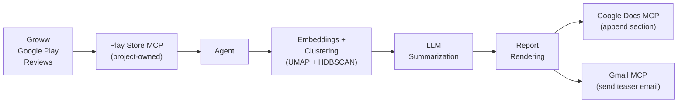

# Weekly Product Review Pulse — Problem Statement

> **Source:** [problemStatement.txt](file:///d:/Product%20Management%20job%20in%203%20months/Groww/docs/problemStatement.txt)

---

## Overview

An automated weekly **"pulse"** that turns public **Google Play Store** reviews for **Groww** into a **one-page insight report**, delivered to stakeholders through **Google Workspace** using **MCP (Model Context Protocol)** — so that all data ingestion and writes to Google Docs and Gmail go through dedicated MCP servers, not ad hoc API calls inside the agent.

**Platform:** Groww (Google Play Store only — current scope)

---

## Objective

Give product, support, and leadership teams a **repeatable, weekly snapshot** of what customers are saying in store reviews — themes, representative quotes, and actionable ideas — without manual copy-paste or one-off spreadsheets.

---

## What the System Does

### 1. Ingest Reviews
- Pull public reviews from the **last 8–12 weeks** (configurable window) from:
  - **Google Play Store** — via a **custom Play Store MCP server built within this project**
- Scoped to **Groww** only in the current version.

> **Note:** The Play Store MCP server is developed and maintained as part of this project. The agent calls it as an MCP tool — no direct scraper code runs inside the agent.

### 2. Cluster & Rank Feedback
- Use **embeddings + density-based clustering** (e.g. UMAP + HDBSCAN).
- LLM names themes, pulls **verbatim quotes**, and proposes **action ideas**.
- **Validation**: Quotes must appear in real review text.

### 3. Render Report
A concise **one-page narrative** containing:
- Top themes
- Quotes
- Action ideas
- A short "who this helps" section

### 4. Deliver via MCP

| Channel | Behavior |
|---|---|
| **Play Store MCP** *(built in this project)* | Fetch Groww's public Google Play reviews for the configured rolling window. |
| **Google Docs MCP** | Append each week's report as a new dated section to a **single running document** (*Weekly Review Pulse — Groww*). The Doc is the **system of record** and preserves history. |
| **Gmail MCP** | Send a short stakeholder email with a **deep link** to the new section in the Doc (heading link) — not a duplicate full report in email. |

> **Important:** The agent is an **MCP host/client**; it does **not** embed Google credentials or call the Docs/Gmail REST APIs directly for delivery.

---

## Internal Architecture (Modular)

| Concern | Where it lives |
|---|---|
| Data retrieval | **Play Store MCP server** (built in this project) — called as an MCP tool by the agent |
| Reasoning | Clustering + LLM summarization (themes, quotes, actions) |
| Output generation | Report + email rendering (structured for Docs, HTML/text for Gmail) |
| Human-visible delivery | MCP tools only → Google Docs MCP + Gmail MCP |

---

## Key Requirements

| # | Requirement | Details |
|---|---|---|
| 1 | **MCP-based ingestion & delivery** | Reviews fetched via the **Play Store MCP server** (project-owned); output delivered via Google Docs MCP and Gmail MCP only — no direct API calls inside the agent. |
| 2 | **Weekly cadence** | Designed to run once per week for Groww (e.g. scheduled job Monday morning IST), with a CLI for backfill of any ISO week. |
| 3 | **Idempotent runs** | Re-running the same product + ISO week must **not** create duplicate Doc sections or duplicate sends. Enforced with a stable section anchor in the Doc and a run-scoped idempotency check on email. |
| 4 | **Auditable** | Each run records delivery identifiers (e.g. doc heading / message IDs) and enough metadata to answer *"what was sent when, for which week?"* |
| 5 | **Safety & quality** | PII scrubbing on review text before LLM and before publishing; reviews treated as data, not instructions; cost/token limits per run. |

---

## Non-Goals (Explicit)

The following are **intentionally out of scope** for this project:

- Support for multiple products (INDMoney, Kuvera, etc.) — **Groww only** in the current version.
- Apple App Store reviews — **Google Play only** in the current version.
- A generic Google Workspace product beyond what the pulse needs (Docs append + Gmail send/draft).
- Real-time streaming analytics or a BI dashboard — the running Google Doc is the living artifact.
- Social sources (Twitter, Reddit, etc.).
- Storing Google OAuth secrets in the agent codebase — they belong in the MCP servers' configuration, per architecture.

---

## Who This Helps

| Audience | Value |
|---|---|
| **Product** | Prioritize roadmap from recurring themes |
| **Support** | Spot repeating complaints and quality issues |
| **Leadership** | Fast health snapshot tied to customer voice |

---

## Sample Output (Illustrative)

### Groww — Weekly Review Pulse
**Period:** Last 8–12 weeks (rolling window)

#### Top Themes

| Theme | Description |
|---|---|
| App performance & bugs | Lag, crashes during trading hours; login/session timeouts |
| Customer support friction | Slow responses; unresolved tickets |
| UX & feature gaps | Confusing navigation for portfolio insights; missing advanced analytics |

#### Real User Quotes

> *"The app freezes exactly when the market opens, very frustrating."*

> *"Support takes days to reply and doesn't solve the issue."*

> *"Good for beginners but lacks detailed analysis tools."*

#### Action Ideas

1. **Stabilize peak-time performance** — Scale infra during market hours; improve crash visibility.
2. **Improve support SLA visibility** — Expected response time in-app; ticket status tracking.
3. **Enhance power-user features** — Advanced portfolio analytics; clearer investments navigation.

#### What This Solves

Same intent as today: roadmap alignment for product, issue clustering for support, and a leadership-friendly snapshot — now **automated**, **archived in Google Docs**, and **announced by email** with a link back to the canonical section.

---

## Delivery Expectations (Stakeholder-Facing)

- Each run adds **one clearly labeled section** to the product's pulse Google Doc (dated / week-labeled).
- The email is a **brief teaser** (e.g. top themes as bullets) plus a *"Read full report"* link to that section.
- Development/staging may default to **draft-only email** until explicit confirmation to send, per implementation plan.

---

## System Flow

